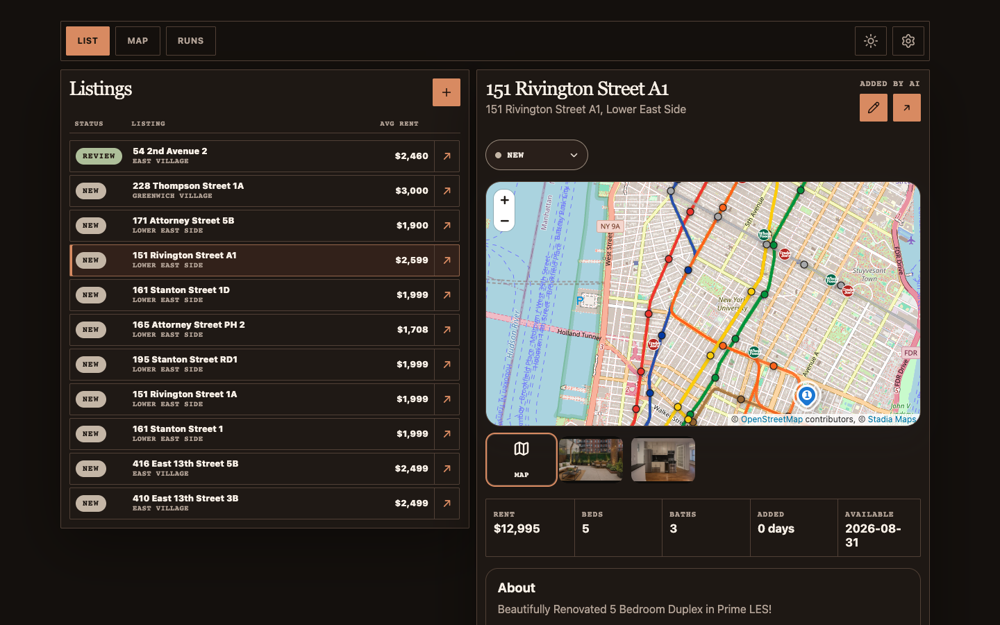
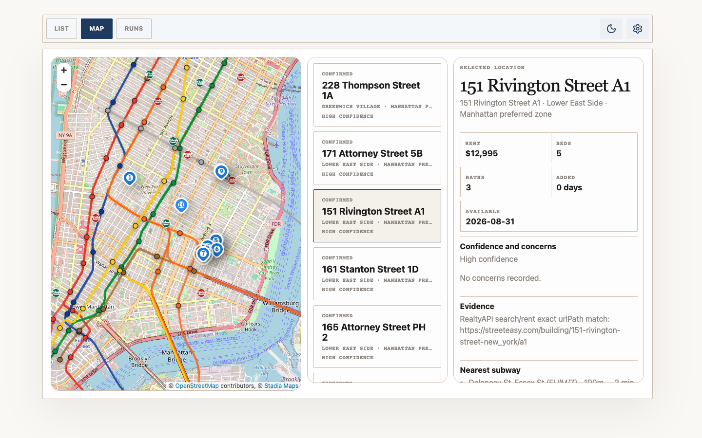
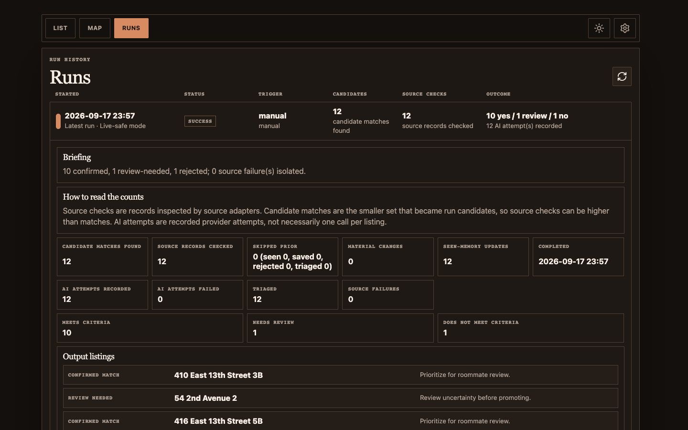
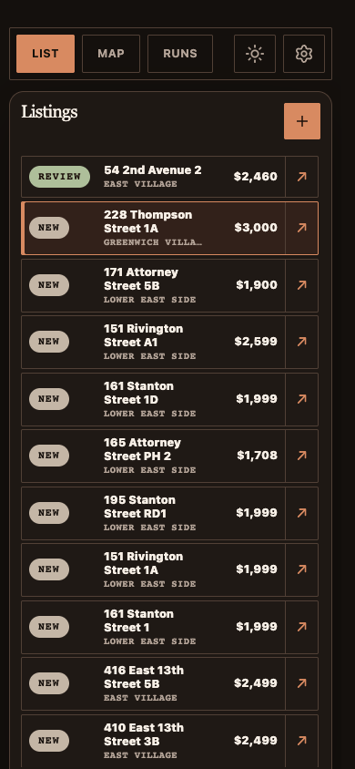

# apt-thing

[](https://github.com/shanebishop1/apt-thing/actions/workflows/ci.yml)

A private shared apartment shortlist for a roommate group hunting for a
five-bedroom apartment in NYC. Members join with one invite code, paste listing
links, review the facts the server extracts, compare locations on a map, and keep
the group's decisions in one place.

## Features

- Save listing URLs with duplicate detection, and keep an editable manual-review
  record when extraction fails.
- Extract details through RealtyAPI for StreetEasy links, or source-page fetching
  plus Gemini for everything else.
- Review rent, rooms, photos, floor plans, evidence, and per-field edit provenance.
- Track interest and touring status, approve or reject candidates, and leave
  comments and reactions.
- Guard concurrent edits with per-listing revisions. A stale edit is rejected with
  a visible conflict instead of silently overwriting, and a rejected listing is
  never recreated by a delayed update.
- Review persisted source-loop runs in the Runs tab: status, source coverage and
  failures, skip counts, triage buckets, and the generated briefing.
- Compare listings on a Leaflet map with neighborhood, subway, and grocery context.
- Use list and map views on desktop or mobile, in light or dark theme.

## Screenshots

<p align="center">
  
  
  <br>
  
  
</p>

## How It Works

```text
Browser  POST /api/group/session      invite code -> HttpOnly, SameSite=Strict cookie
Browser  GET/POST /api/group/listings -> RealtyAPI or source page + Gemini
                                      -> D1: listings (revisioned), group actions
Browser  PATCH /api/group/listings/:id  revision-checked status, field, and decision edits
Browser  GET  /api/group/runs         -> persisted daily-loop run history
Browser  GET  /api/map/tiles/:z/:x/:y -> Stadia Maps, falling back to OpenStreetMap
Cron     (disabled by default)        -> src/worker.ts scheduled -> daily source loop
```

Next.js App Router, React, TypeScript, Leaflet, and plain CSS on the front end.
Every API route authorizes against the server-only `GROUP_INVITE_CODES` value,
either through the session cookie or an operator `X-Invite-Code` header, and the
group is always taken from the authenticated identity. Shared state lives in
Cloudflare D1. Browser storage holds only the entered invite code, display name,
and UI preferences. OpenNext packages the app for Cloudflare Workers, with
`src/worker.ts` supplying the fetch and scheduled entrypoints.

### Data Sources And Attribution

Base map data comes from OpenStreetMap contributors under the Open Database
License (ODbL). Raster tiles come from Stadia Maps when `STADIA_MAPS_API_KEY` is
set and from OpenStreetMap's standard tiles otherwise. Subway station names,
routes, and coordinates come from the MTA Subway Stations dataset (39hk-dx4f) on
data.ny.gov, Metropolitan Transportation Authority open data republished by New
York State under the data.ny.gov terms of use; `scripts/build-subway-stations.mjs`
regenerates the committed module and the map carries the credit. The subway route
and stop overlay is drawn from the MTA Subway Routes & Stops feature service.
StreetEasy listing facts come from RealtyAPI, which is not affiliated with
StreetEasy. Other sources are read from the fetched page and extracted by Google
Gemini, whose output is not a guarantee of accuracy.

## Project Layout

| Path                | Contents                                                                   |
| ------------------- | -------------------------------------------------------------------------- |
| `app/`              | App Router pages plus the `group`, `platform`, and `map` API routes.       |
| `src/components/`   | Review UI: workspace, listing editor, Leaflet map, run history panel.      |
| `src/lib/`          | Auth, route plumbing, extraction, triage, D1 stores, agent contracts.      |
| `src/lib/daily-loop/` | Source loop parts: sources, candidates, briefing, persistence, analyzer. |
| `src/lib/utils/`    | Small shared helpers for ids, JSON, records, text, and concurrency.        |
| `src/test-support/` | Test helpers, including an in-memory SQLite stand-in for D1.               |
| `migrations/`       | D1 schema, applied with Wrangler.                                          |
| `scripts/`          | Client-asset secret scan and the RealtyAPI proof script.                   |

## Run It Locally

Add a local `DB` binding to `wrangler.jsonc` first; [SETUP.md](SETUP.md) has the
exact block. Then:

```sh
pnpm install --frozen-lockfile
cp .env.example .env
echo "GROUP_INVITE_CODES=nyc-5br-2026=$(openssl rand -hex 16)" >> .env
pnpm exec wrangler d1 migrations apply DB --local
pnpm dev
```

Open `http://localhost:3000` and enter the code you just generated. No cloud
account or paid provider key is needed for the manual-review path.

## Verification

```sh
pnpm check
```

That runs `format:check`, `lint`, `typecheck`, `test`, `build`, and
`check:client-secrets` in order. Oxfmt and Oxlint cover `app`, `src`, `scripts`,
and the root config files; `typecheck` regenerates Next's types before running
`tsc`. Vitest covers behavior against fixtures, mocks, and an in-memory
`node:sqlite` database that applies the real migrations.
`check:client-secrets` fails the build if a server-only value reaches the client
bundle. GitHub Actions runs the same checks on pushes to `main` and pull
requests, and never deploys.

## Limits And Security Posture

- The committed Cloudflare configuration is hibernated: no database, cache, or
  workflow bindings, an empty cron list, and no public Worker URL. Starting
  Next.js alone does not produce a working shared database.
- Access is one shared invite code plus a self-chosen display name, not per-person
  accounts. Anyone with the code can act as any display name, and invite attempts
  are not rate limited. Use a long random code and rotate it if it leaks, which
  revokes every existing session.
- Extraction depends on source access and provider availability. Blocked pages,
  missing keys, or partial results need manual review. Model output is not a
  guarantee of accuracy, availability, or suitability.
- The Runs tab shows only runs persisted to D1, so it is empty until a run
  executes. Fixture runs are labeled as such. Scheduled discovery is off by
  default and is not a comprehensive search of every rental site.
- Maps and source-hosted images need external network access. Raw image and
  artifact storage is disabled; there is no R2 archive.

## Setup

See **[SETUP.md](SETUP.md)** for a clean-clone walkthrough: the local D1 database,
invite codes, API checks, optional provider credentials, the source loop, and
optional Cloudflare deployment.

## License

MIT. See [LICENSE](LICENSE).
